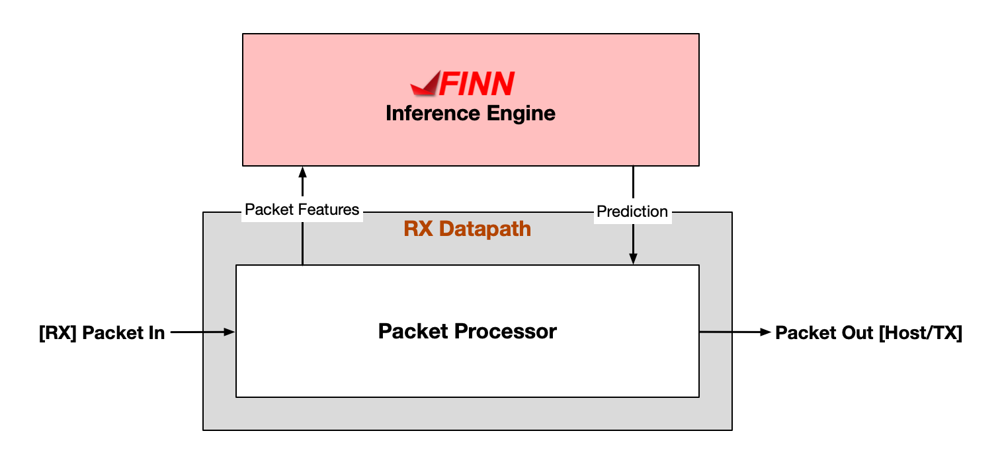

# Data plane AI

Programmable network devices, such as SmartNICs (e.g. AMD Alveo SmartNICs),
DPUs (e.g. AMD Pensando DPU), and programmable switches (e.g. Intel Tofino),
are gaining popularity as they enable faster pace of innovation and more
customisability for the end-user. Vendors have also adopted this trend,
supporting languages such as P4 (e.g. Pensando and Tofino are P4-programmable)
and eBPF (e.g. eBPF offload to Netronome FPCs), which has inspired network
engineers to test and implement many new interesting use-cases in the network
data plane, such as traffic classification, in-network consensus, in-network
DNS, and more.

Modern machine learning methods, such as deep neural networks (DNNs), have had
a profound impact on many application domains, most notably on computer vision
and natural language processing. As expected, there is a long-tail of
applications that can benefit from modern DNNs, and networking applications are
not an exception. There is an increased interest in bringing more intelligence
to networking applications, and hence a strong demand to enable DNN inference
in the network data plane, often referred to as **Data Plane AI**.

However, in order to enable Data Plane AI, the DNN inference accelerator needs
to be able to handle the challenging high data-rate environment of the network
data plane. Furthermore, programmable network devices either have limited or
unsuitable compute resources for DNNs in the data plane (extraction of features
and/or execution of DNN model). Hence, end-users often fall back to executing
DNN-based inference in the control plane, which is not suitable for low-latency
per-packet operations at high line-rates. The figure below shows the high-level
architectural motivations behind this work.

<p align="center">
    
</p>

Here, we only show the RX datapath of a hypothetical networking device that has
an FPGA fabric for mapping FINN inference engine designs to. The programmable
packet processor can compute features and issue inference requests to the FINN
accelerator, which computes the output using weights that were trained offline,
and feeds the prediction back into the packet processor. The packet processor
can then take this prediction result and use it to make packet/flow forwarding
decisions in the data plane. In order to enable this vision, ideally, the
inference engine should be capable of inference throughputs that meet peak
observed packet-rates in the data plane, which on modern data-center devices,
can be in the order of tens-to-hundreds of millions of packets-per-second.

This FINN example focuses on the FINN inference engine design for a Network
Intrusion Detection System (NIDS) use-case. One of the goals of NIDS is to
classify active traffic flows into malicious (e.g. DDoS attacks) or benign
categories. Flows that are classified as malicious can be dropped and/or
blocked, and future prevention mechanisms can then be integrated into the NIDS.
Our case study focuses on the first step of NIDS, which is modeled as an
anomaly detection task. This FINN example showcases how to take trained DNN
models (trained on open-source network traffic datasets) and compile them them
for high-throughput deployments in FPGA-based SmartNICs (e.g., Alveo U250 with
OpenNIC shell).

In order to build the complete FPGA bitstream, we need to interface this FINN
model with custom RTL (e.g. the packet processor in the figure above) and put
the design inside a networking shell, such as the [OpenNIC
Shell](https://github.com/Xilinx/open-nic). This step is currently not part of
this FINN example, and will be added at a later date.

# Build the FINN inference engine stitched IP
0. Ensure you have performed the *Setup* steps in the top-level README for setting up the FINN requirements and environment variables.

1. Edit the `ddos-anomaly-detector-mlp/build.py` to restrict the platform variables to the ones that you are interested in, e.g. `platforms_to_build = ["U250"]` for building an IP targeting the Alveo U250 platform. You can also change the other build configuration options, see the [FINN docs](https://finn-dev.readthedocs.io/en/latest/source_code/finn.util.html#finn.util.build_dataflow.DataflowBuildConfig) for a full explanation.

2. Launch the build as follows:
```shell
# update this according to where you cloned this repo:
FINN_EXAMPLES=/path/to/finn-examples
# cd into finn submodule
cd $FINN_EXAMPLES/build/finn
# launch the build on the ddos-anomaly-detector-mlp folder
./run-docker.sh build_custom $FINN_EXAMPLES/build/ddos-anomaly-detector-mlp
```

3. The generated outputs will be under `ddos-anomaly-detector-mlp/output_<topology>_<platform>`. You can find a description of the generated files [here](https://finn-dev.readthedocs.io/en/latest/command_line.html#simple-dataflow-build-mode).

# Where did the ONNX model file come from?

The ONNX model is created and exported prior to the build flow is launched. You can find the details of this process in the `ddos-anomaly-detector-mlp/custom_steps.py` file.

We'd like to thank the Canadian Institute for Cybersecurity for providing open-source network traffic datasets. For this use-case, we use the CIC-IDS2017 dataset which can be [found here](https://www.unb.ca/cic/datasets/ids-2017.html). More details of the dataset and underlying methodologies used to collect the data can be found in their paper:

```
Iman Sharafaldin, Arash Habibi Lashkari, and Ali A. Ghorbani, “Toward Generating a New Intrusion
Detection Dataset and Intrusion Traffic Characterization”, 4th International Conference on
Information Systems Security and Privacy (ICISSP), Portugal, January 2018
```

# Citation

More details about the preprocessed dataset, modeling, and implementation can be found in [our demo paper](https://dl.acm.org/doi/abs/10.1145/3630047.3630191). You can cite our work using the following bibtex snippet:

```
@inproceedings{siddhartha2023enabling,
  title={Enabling DNN Inference in the Network Data Plane},
  author={Siddhartha and Tan, Justin and Bansal, Rajesh and Chee Cheun, Huang and Tokusashi, Yuta and Yew Kwan, Chong and Javaid, Haris and Baldi, Mario},
  booktitle={Proceedings of the 6th on European P4 Workshop},
  pages={65--68},
  year={2023}
}
```
