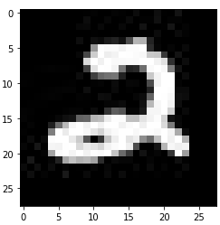

# FINN Example FPGA Flow Using MNIST Numerals

This example demonstrates how to bring a FINN compiled model into a traditional FPGA design environment for integration into a larger application. It extends on the command-line [build_dataflow](https://github.com/Xilinx/finn/tree/master/src/finn/qnn-data/build_dataflow) using a model that was quantized with [Brevitas](https://github.com/Xilinx/brevitas) down to single-bit weight/ativation precision to classify hand-written numerals in the MNIST data set. 

If you are new to the command-line flow, more information can be found [here](https://finn.readthedocs.io/en/latest/command_line.html)

This demo was created using Vivado 2020.1.  

## Compiling the model in FINN

#### Configuratino
The file `build.py` handles all the configuration needed to compile the model into a "stitched IP" that will be used to integrate into a greater FPGA application design.  The following points will need to be set appropriately for a specific applicati usage:
- `output_dir` defines the directory to be created for FINN compiler output.
- `target_fps` desired performance target for FINN compiler to acheive.
- `mvau_wwidth_max`: this is an optional parameter ([described here](https://finn.readthedocs.io/en/latest/source_code/finn.builder.html#finn.builder.build_dataflow_config.DataflowBuildConfig.mvau_wwidth_max)) to illustrate how to pass additional confiration points to the compiler.
- `folding_config_file`: is an optional parameter that points to a json file defining the optimizations (PE,SIMD,ramstyle, etc.) used by FINN compiler.  
- `synth_clk_period_ns`: set the desired clock period in nS.
- `fpga_part is used` to configure the IP for your target device that you'll bring the stitched IP into.  It should be the full part number string recognized in Vivado: <device>-<package>-<temperature-grade>-<speed_grade>
- `generate_outputs`: for integration purposes, the only output we need is `...STITCHED_IP`.  You might find the ESTIMATE_REPORTS interesting and it doesn't add any significant runtime.  Other options are documented [here](https://finn.readthedocs.io/en/latest/command_line.html#generated-outputs) and some of them (namely OOC_SYNTH, BITFILE) add substantial runtime.

#### Running FINN Compiler

Prior to running, insure the following prerequisites have been met:
- Install FINN. A helpful script may be of use: `finn-examples/build/get_finn.sh` 
- Insure you have `VIVADO_PATH` env variable is set appropriately for your install.  For example:
> export VIVADO_PATH=/opt/Xilinx/Vivado/2020.1
- For convenience, set env variable for you `finn-examples` directory:
> export FE_PATH=/home/foo/finn-examples

Then, change to `finn` install direcoty and invoke:

> ./run-docker.sh build_custom ${FE_PATH}/build/fpga_flow/

The build should finish in about 10 minutes, and the FINN docker will close on success.

> ...
> Running step: step_create_stitched_ip [11/16]
> Running step: step_measure_rtlsim_performance [12/16]
> Running step: step_out_of_context_synthesis [13/16]
> Running step: step_synthesize_bitfile [14/16]
> Running step: step_make_pynq_driver [15/16]
> Running step: step_deployment_package [16/16]
> Completed successfully
> The program finished and will be restarted

#### Examine the Stitch IP

Navitage to the stitched IP project direcoty:

> cd ${FE_PATH}/build/fpga_flow/output_tfc_w0a1_fpga/stitched_ip

And, open the project:

> vivado finn_vivado_stitch_proj.xpr

Explore the IPI board design and note the interfaces.  

#### Simulate the Stitch IP using Verilog Test Bench

The inluded `testbench.sv` is a very simple test to illustrate how to feed data to the compiled model. 

The image data is 784 bytes per frame, organized as 28x28 unsigned integer bytes.  However, due to the  folding optimizations chosen the input data to the hardware is 49 bytes per cycle  over 16 cycles.  Note how this matches PE=49 as selected for the first layer in `folding_config.json` 
Using the following image for coordinate reference where a byte is indentified as <Brow_column> we see  that B0_0 is the upper leftmost byte, and B27_27 is the lower right most byte:

Thus, the input data for the first cycle is organized as such:
>  s_axis_0_tdata[391:0] = {B1_20,B1_19,  ,B1_0,B0_27,  ,B0_1,B0_0};

The testbench reads data from data.hex. For convenience, the included script `gen_tb_data.py` creates the test data and ground truth expectations (Note: using ground truth is undesirable if the intent is to validate the HW implementation matches the trained model).  The script does take iberty was taken of flipping the bytes such that veriliog's $readmemh brings B0_0 nicely into the LSB position.   To generate the test data:

> cd ${FE_PATH}/build/fpga_flow/output_tfc_w0a1_fpga/stitched_ip
> mkdir -p finn_vivado_stitch_proj.sim/sim_1/behav/xsim
> ../../gen_tb_data.py > finn_vivado_stitch_proj.sim/sim_1/behav/xsim/data.hex

In Vivado, add the testbench as a simulation file. Paste this in to the Tcl Console:
> add_files -fileset sim_1 -norecurse ../../testbench.sv

Then, run the simulation (Flow Navigator -> Simulation -> Run Simulation).   Do a `run -all`  (click the "play" button in the simulator) to run the sime to it's $finish conclusion.  With 20 data points run, it should have 1 mismatch due using the ground-truth as the check source:

> ************************************************************ 
>  SIM COMPLETE
>   Validated 20 data points 
>   Total error count: ====>  1  <====

#### Instantiation in Mission Design

There are any number of ways to bring the stitched IP into another design.  

You may want to package the stitched IP BD (or entire project) as its own IP.  A good reference for this is [UG1119](https://www.xilinx.com/support/documentation/sw_manuals/xilinx2020_1/ug1119-vivado-creating-packaging-ip-tutorial.pdf)  

Keep in mind that all of the User IP Repo's used in the Stitched IP project (stored in /tmp) need to also be brought in as IP Repo's for any project using the stitched IP. 

